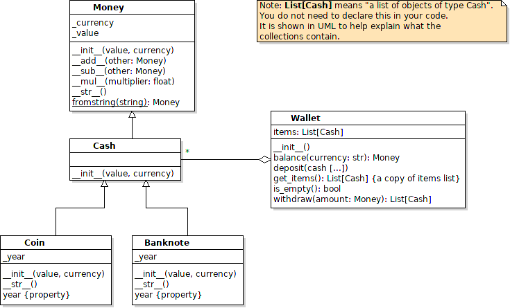

## Lab 2.2 Wallet

Write a Wallet application where you can deposit and withdraw Cash.
You will need the Money class you already wrote.

### Definitions (Domain Knowledge)

**Money** is an abstraction for a quantity of currency.  Money can have any value, including zero or negative.  For example, the balance on a credit card is "money". It may be positive (net deposits), zero, or negative (debt).

**Cash** refers to physical units of Money, primarily coins and banknotes. The value is always positive.

**Coin** and **Banknote** are kinds of Cash.  They are interchangeable. In physical money, Banknotes also have a serial number but we don't include that.

**Atomicity** a method or operation is "atomic" if it is performed as a single operation.  Either the entire operation succeeds or the entire operation fails.  There is no "partial success".  Examples:

* when you do `git push`, "push" either succeeds (pushes all files) or fails (pushes nothing). It never uploads some files but not others.
* when you transfer money from one bank account to another, either the entire transfer exceeds or fails.  It never deducts money from one account without (eventually) depositing it in another account. 
* if you deposit multiple Cash objects in a Wallet, either they are all deposited or nothing is deposited (no partial deposits).


### Design Rule: Design for Extension

In this application we have only Coin and Banknote as concrete subclasses of Cash.  But other forms of cash-equivalent are possible.  How about a Gift Certificate or Voucher with a monetary value?

So, do not write code that assumes the only kinds of Cash are Coin and Banknote.


### 1. Write "subtraction" in the Money class

In this lab, you will need to subtract money.  Write a `__sub__` method in Money, that obeys the same rules as `__add__`:
```python
def __sub__(self, other):
    """Subtract another money value (other) from this one, provided that the
    currencies are the same.

    Arguments:
        other: another Money object having the same currency as this one.
    Returns:
        a new Money object whose value is the difference between this and other.
        The value may be positive, zero, or negative.
    Raises:
        ValueError if the currencies are not the same.
        TypeError if other is not an instance of Money or a subclass of Money.
    """
```

### 2. Implement a Hierarchy of Cash Types

Create a file named `cash.py` containing 3 classes:

* **Cash** - a subclass of Money.  It does not add any new behavior to Money, but the constructor verifies that the **value is positive** before calling the superclass constructor.  (*This is easy.*)
  - if the value is not positive, raise a ValueError

* **Coin** - a subclass of Cash.  Coin is like Cash with these changes:
  - it has a `_year` attribute that is the year the object was created (like the mint date on physical coins).
  - constructor computes the year itself! year is **not** a parameter.
  - a read-only property for the year
  - `str(coin)` returns the same thing as Money but append "Coin", for example "5 Baht Coin" or "0.50 Baht Coin".

* **Banknote** - a subclass of Cash. Banknote is like Cash with these changes:
  - the **value** must be evenly divible by 10.  No 5 Baht or 2.5 Baht banknotes. Raise the appropriate exception if the value is invalid.
  - it has a `_year` attribute this is the year the object was created
  - constructor computes the year itself! year is **not** a parameter.
  - a read-only property for the year
    ```python
    self.serial_number = str(id(self))
    ```
  - `str(banknote)` returns the same thing as Money but append "Banknote", for example "1,000 Baht Banknote"





### 3. Write a Wallet class in `wallet.py`

A Wallet stores cash.  It has these methods:

| Method             | Definition                  |
|--------------------|-----------------------------|
|`__init__()`        | Initialize an empty wallet. |
|`balance(currency: str): Money` | Get the total value of money in the wallet for a given currency. |
|`deposit(*cash)`    | Deposit one or more cash items.  "deposit" should be atonomic. If any of the parameters are invalid, the entire operation is cancelled. You can deposit different currencies at the same time, but the arguments must all be Cash with a positive value. |
|`is_empty(): bool`  | Test if the wallet is empty. |
|`get_items(): List` | Return a **copy** of the list of items in the Wallet. A shallow copy is returned (since the Cash objects are immutable it isn't necessary to copy them). |
|`withdraw(money): List` | Withdraw a requested amount (Money) from the wallet. Return a list of cash objects from the wallet or `None` if the exact amount cannout be withdrawn.  This method respects currency, so withdraw(Money(5,'Baht')) is different from withdraw(Money(5,'Rupee')). |
    
Example:
```
>>> wallet = Wallet()
>>> wallet.is_empty()
True
>>> wallet.balance("Baht")    # returns a Money object
Money(0, 'Baht')
>>> wallet.deposit(Coin(5,"Baht"), Banknote(20,"Dollars"), Coin(10,"Baht"))
>>> print(wallet.balance("Baht"))
15 Baht
>>> print(wallet.balance("Dollars"))
20 Dollars
>>> print(wallet.balance("Rupee"))
0 Rupee
>>> wallet.deposit(Banknote(20,'Baht'))
>>> wallet.get_items()
[Coin(5,'Baht'), Banknote(20,'Dollars'), Coin(10,'Baht'), Banknote(20,'Baht')]
>>> wallet.withdraw(Money(30,'Baht'))
[Coin(10,'Baht'), Banknote(20,'Baht')]
>>> wallet.withdraw(Money(10,'Baht')
None
>>> wallet.balance('Baht')   # returns Money
Money(5,'Baht')
```

### 4. Write a "Helper Function" to Perform Recursive Withdraw

To implement withdraw you need to use recursion.  The algorithm is nearly the same as the `groupsum` recursion problem.  The only differences are:

* objects are Cash (or Money) instead of "int"
* you need to check that the currency matches what is desired. Only withdraw items that have the correct currency.

I suggest you write a helper function named `withdraw_from`:
```python
def withdraw_from(amount: Money, items: List[Cash]) -> List[Cash]
```

in this method use an algorithm similar to the way you solved `groupsum`.

This method **should not change the `items` parameter**.
Just return what you want to withdraw.  

In `Wallet.withdraw` you call the helper method. 
When it returns, you look at the return value (a list) and withdraw each of the objects from the Wallet's `items` using `items.remove(object)`.
Then return the cash (the list that `withdraw_from` returned).

Where to write `withdraw_from`?  It could be either:

- a top-level function in `wallet.py`, or
- a `@staticmethod` inside the Wallet class.  Its `@staticmethod` because you don't want or need a "self" or "cls" reference as first parameter.

## How To

* How to get today's date and the year?
  ```python
  import datetime
  today = datetime.date.today()
  year = today.year
  ```

* How to write a function with a variable number of parameters?
  - use `*args` as parameter. You can use **any** parameter name instead of "args". Only the `*` is important.
    ```python
    def printall(*args):
        """ args contains a tuple of the arguments"""
        for x in args:
            print(x)

    >>> printall("hi")
    hi
    >>> printall("many", "args", 22, "!")
    many
    args
    22
    !
    ```
   - for a **method** with variable number of arguments, write the "self" parameter before the var-args:
     ```python
     def methodname(self, *args)
     ```

* How to create a shallow copy of a list?
  ```python
  import copy
  lst = [1,2,3]
  list2 = copy.copy(lst)
  list2.pop()
  3
  list2
  [1, 2]
  # but the original list does not change
  lst
  [1, 2, 3]
  ```

* What's a shallow copy?    
  For a list, a **shallow** copy copies the list but does not make a copy of each element in the list.  Instead it just *references* the same objects as the original list.    
  Is this a problem?  No - because Money and Cash are *immutable*. So two lists (wallet.items and the returned list) can refer to the same Cash object, but code cannot change the Cash object.
